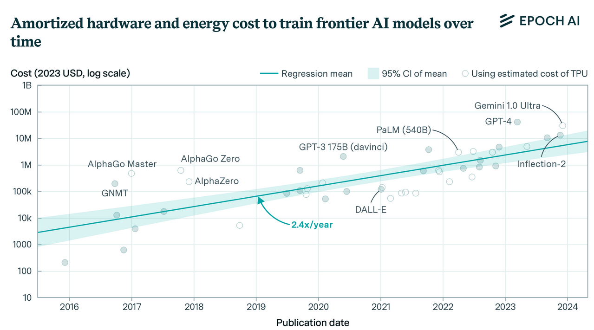

# Unidad 1 - Clase 02 - IA generativa

---

## 1. Introducción a herramientas de IA generativa

- IA generativa: técnicas y modelos capaces de crear contenido nuevo y original
- Democratiza la IA: uso mediante indicaciones en lenguaje natural
- Aplicaciones: escribir informes, crear aplicaciones, etc.
- En desarrollo desde los años 60
- Ejemplos: OpenAI ChatGPT, Anthropic Claude, Google Gemini

---

---

## 1.1 Fundamentos de la IA generativa

- Basada en aprendizaje no supervisado
- Utiliza redes neuronales complejas
- Grandes modelos de lenguaje generan texto autocompletando

---

---

## Proceso de inferencia en modelos de lenguaje natural

---

## Evolución del tamaño de los modelos

---

## Costos de entrenamiento de modelos

---

## 1.2 Tipos de modelos generativos

Los modelos generativos se pueden dividir entre los siguientes tipos:

graph TD
    A[-Modelos Generativos-----] --> B[GANs]
    A --> C[Modelos Autoregresivos]
    A --> D[-VAEs--]
    A --> E[Modelos de Difusión]
    B --> F[Generador]
    B --> G[Discriminador]
    C --> H[GPT]
    D --> I[Encoder]
    D --> J[Decoder]

---

## 1.3 Aplicaciones de la IA generativa

mindmap
  root((IA Generativa))
    Texto
      Artículos
      Poesía
      Guiones
      Código
    Imágenes
      Ilustraciones
      Fotografías
      Arte conceptual
    Audio
      Voces artificiales
      Composición musical
    Diseño
      Logos
      Productos
      Arquitectura
    Ciencia
      Diseño de moléculas
      Simulaciones

---

## Tipos de LLMs por tarea

graph LR
    A[Tipos de LLMs---] --> B[Audio y Voz---]
    A --> C[Imágenes--]
    A --> D[Texto-]
    A --> E[Multi-modal--]
    B --> F[Whisper]
    C --> G[DALL-E]
    C --> H[Midjourney]
    D --> I[GPT-3.5]
    D --> J[GPT-4]
    E --> K[GPT-4 Turbo con visión]

---

## Modelos de base vs LLMs

---

## Modelos multi-modales

---

## Código abierto vs Propietarios

classDiagram
    class LLMs {
        +Código Abierto
        +Propietarios
    }
    class CódigoAbierto {
        +Disponibles públicamente
        +Personalizables
        +Ejemplos: Alpaca, Bloom, LLaMA
    }
    class Propietarios {
        +Propiedad de empresas
        +Optimizados para producción
        +Ejemplos: OpenAI, Google Bard, Claude 2
    }
    LLMs --> CódigoAbierto
    LLMs --> Propietarios

---

## Embeddings

---

## Generación de imágenes

---

## Generación de texto y código

---

## Arquitecturas de LLMs

graph TD
    A[Arquitecturas de LLMs] --> B[Solo Decoder]
    A --> C[Solo Encoder]
    A --> D[Encoder-Decoder]
    B --> E[GPT]
    C --> F[BERT]
    D --> G[BART]
    D --> H[T5]
    B --> I[Bueno generando contenido]
    C --> J[Bueno entendiendo contexto]
    D --> K[Combina generación y comprensión]

---

## Servicio vs Modelo

graph TD
    A[LLMs] --> B[Servicio]
    A --> C[Modelo]
    B --> D[Proveedor de 
    Servicios en la Nube-----]
    B --> E[Optimizado para producción]
    B --> F[Ejemplo: Azure OpenAI Service]
    C --> G[Componente central Red Neuronal]
    C --> H[Puede requerir infraestructura propia]
    C --> I[Ejemplo: LLaMA]

---

# Ingeniería de prompts