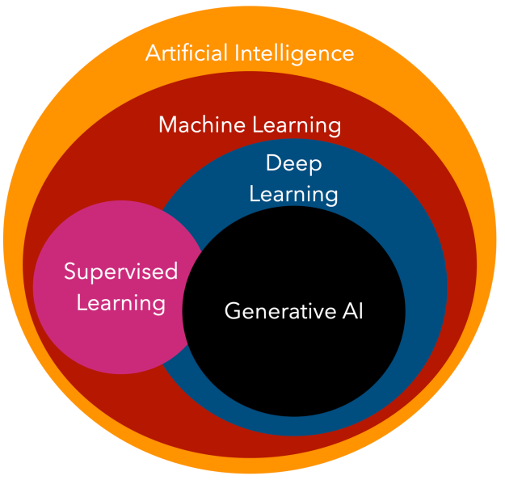
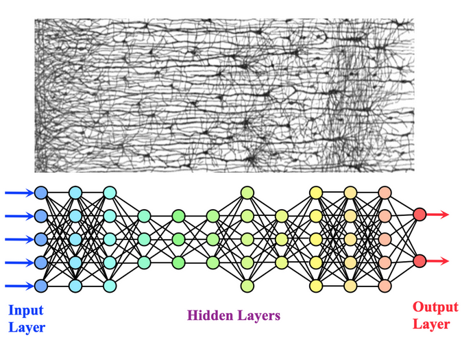
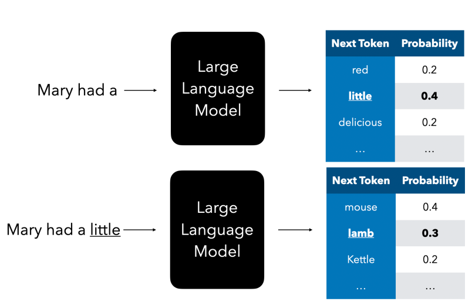
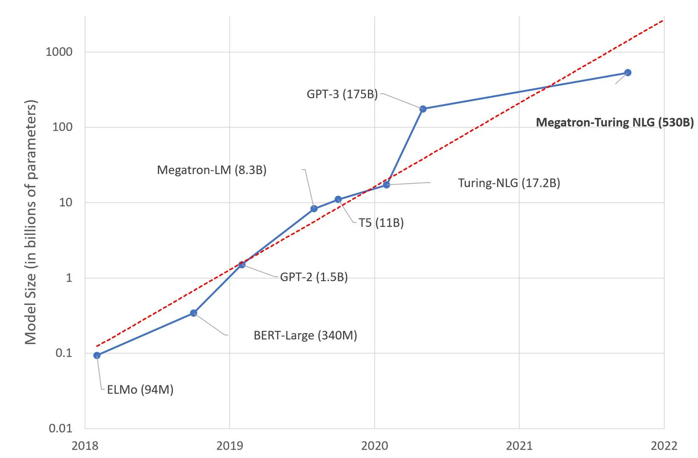

# Unidad 1 - Clase 02 - IA generativa

## 1. Introducción a herramientas de IA generativa

La Inteligencia Artificial (IA) generativa se refiere a un conjunto de técnicas y modelos de aprendizaje automático capaces de crear contenido nuevo y original. Estas herramientas han revolucionado múltiples campos, desde el arte y el diseño hasta la ciencia y la ingeniería.

La IA generativa es una inteligencia artificial capaz de generar texto, imágenes y otros tipos de contenido. Lo que la convierte en una tecnología fantástica es que democratiza la IA, cualquiera puede usarla con tan solo una indicación de texto, una oración escrita en un lenguaje natural. No es necesario que aprenda un lenguaje como Java o SQL para lograr algo que valga la pena, todo lo que necesita es usar su lenguaje, decir lo que quiere y obtendrá una sugerencia de un modelo de IA. Las aplicaciones y el impacto de esto son enormes, puede escribir o comprender informes, crear aplicaciones y mucho más, todo en segundos.

A pesar del extraordinario entusiasmo creado recientemente por el anuncio de modelos de IA generativa, esta tecnología lleva décadas en desarrollo, con los primeros esfuerzos de investigación remontándose a los años 60. Ahora estamos en un punto en el que la IA tiene capacidades cognitivas humanas, como la conversación, como se muestra, por ejemplo [OpenAI ChatGPT](https://chatgpt.com/auth/login), [Anthropic Claude](https://claude.ai/) o [Google Gemini](https://gemini.google.com).

### 1.1 Fundamentos de la IA generativa

La IA generativa se basa en el aprendizaje no supervisado, donde los modelos aprenden patrones y estructuras a partir de grandes conjuntos de datos sin necesidad de etiquetas específicas. Estos modelos utilizan arquitecturas de redes neuronales complejas para capturar y replicar las características esenciales de los datos de entrada.

En el caso de la generación de texto, se lograron grandes modelos de lenguaje que generan textos a base de autocompletar la palabra siguiente. 

La explosión de estos modelos en el ultimo tiempo estuvo dada por los avances de la capacidad de cómputo de las máquinas como por la implementación de arquitecturas eficientes para distintos objetivos en estas complejas topologías, siendo la arquitectura transformers la mas importante de ellas para este último boom en el caso de los modelos de lenguaje. Esto fue lo que llevó a la mejora de la calidad de las generaciones producidas por los modelos cada vez mas grandes en tamaño de parámetros que tenemos actualmente. 

Ahora, también los costos de estos modelos son cada vez mas altos de entrenar!

### 1.2 Tipos de modelos generativos

1. **Redes Generativas Antagónicas (GANs)**: Consisten en dos redes neuronales que compiten entre sí: un generador que crea contenido y un discriminador que intenta distinguir entre el contenido real y el generado. Esta competencia mejora continuamente la calidad de las salidas.

2. **Modelos Autoregresivos**: Predicen la siguiente unidad de contenido (como una palabra o un píxel) basándose en las unidades anteriores. GPT (Generative Pre-trained Transformer) es un ejemplo destacado en el procesamiento del lenguaje natural.

3. **Variational Autoencoders (VAEs)**: Combinan la codificación de características con la generación, permitiendo tanto la compresión de datos como la creación de nuevos ejemplos.

4. **Modelos de Difusión**: Aprenden a revertir gradualmente un proceso de adición de ruido, generando contenido de alta calidad paso a paso.

### 1.3 Aplicaciones de la IA generativa

- Generación de texto: desde artículos y poesía hasta guiones y código de programación.
- Creación de imágenes: ilustraciones, fotografías realistas, arte conceptual.
- Síntesis de voz y música: voces artificiales, composición musical.
- Diseño: creación de logos, diseños de productos, arquitectura.
- Ciencia e investigación: diseño de moléculas, simulación de escenarios complejos.

## 2. Tipos de LLMs

Los LLMs pueden tener múltiples categorizaciones basadas en su arquitectura, datos de entrenamiento y caso de uso. Entender estas diferencias nos ayudará a seleccionar el modelo adecuado para el escenario, y comprender cómo probar, iterar y mejorar el rendimiento.

Hay muchos tipos diferentes de modelos LLM, tu elección de modelo depende de para qué apuntás a usarlos, tus datos, cuánto estás dispuesto a pagar y más.

Dependiendo de si apuntás a usar los modelos para texto, audio, video, generación de imágenes y demás, podrías optar por un tipo diferente de modelo.

- **Reconocimiento de audio y voz**. Para este propósito existen modelos orientados al reconocimiento de voz. Están entrenados en audio diverso y pueden realizar reconocimiento de voz multilingüe. Por ejemplo, OpenAI tiene unos modelos llamados [Whisper](https://platform.openai.com/docs/models/whisper?WT.mc_id=academic-105485-koreyst). Otro nuevo competidor del espacio es [Elevenlabs](https://elevenlabs.io/).

- **Generación de imágenes**. Para generación de imágenes, DALL-E y Midjourney son dos opciones muy conocidas. DALL-E es ofrecido por OpenAI. [Leé más sobre DALL-E acá](https://platform.openai.com/docs/models/dall-e?WT.mc_id=academic-105485-koreyst). Existen hasta algunos open source como [Stable Diffusion](https://github.com/Stability-AI/generative-models) de [Stability AI](https://stability.ai/) y [Flux](https://flux1.org/#use) de [Black Forrest Labs](https://blackforestlabs.ai/).  

- **Generación de texto**. La mayoría de los modelos están entrenados en generación de texto y tenés una gran variedad disponible en tamaños, con distintas prestaciones en cuanto a tiempos de generación y calidad de resultados producidos. Una de las tareas mas importantes a la hora de trabajar con IA generativa es evaluar qué modelos se ajustan mejor a tus necesidades en términos de capacidad y costo.

- **Multi-modalidad**. Si estás buscando manejar múltiples tipos de datos en entrada y salida, podrías querer mirar modelos como [gpt-4 turbo con visión o gpt-4o](https://learn.microsoft.com/azure/ai-services/openai/concepts/models#gpt-4-and-gpt-4-turbo-models?WT.mc_id=academic-105485-koreyst), los últimos lanzamientos de modelos de OpenAI que son capaces de combinar procesamiento de lenguaje natural con comprensión visual, permitiendo interacciones a través de interfaces multi-modales.

Seleccionar un modelo significa que obtenés algunas capacidades básicas, que sin embargo podrían no ser suficientes. A menudo tenés datos específicos de una empresa que de alguna manera necesitás decirle al LLM. Hay algunas opciones diferentes sobre cómo abordar eso, más sobre eso en las próximas secciones.

### Modelos de base versus LLMs

El término Modelo de Base fue [acuñado por investigadores de Stanford](https://arxiv.org/abs/2108.07258?WT.mc_id=academic-105485-koreyst) y definido como un modelo de IA que sigue algunos criterios, tales como:

- **Son entrenados usando aprendizaje no supervisado o aprendizaje auto-supervisado**, lo que significa que son entrenados en datos multi-modales no etiquetados, y no requieren anotación humana o etiquetado de datos para su proceso de entrenamiento.
- **Son modelos muy grandes**, basados en redes neuronales muy profundas entrenadas en miles de millones de parámetros.
- **Normalmente están destinados a servir como una 'base' para otros modelos**, lo que significa que pueden ser usados como punto de partida para que otros modelos se construyan encima, lo cual puede hacerse mediante fine-tuning.

Fuente de la imagen: [Essential Guide to Foundation Models and Large Language Models | por Babar M Bhatti | Medium
](https://thebabar.medium.com/essential-guide-to-foundation-models-and-large-language-models-27dab58f7404)

Para aclarar aún más esta distinción, tomemos ChatGPT como ejemplo. Para construir la primera versión de ChatGPT, un modelo llamado GPT-3.5 sirvió como el modelo de base. Esto significa que OpenAI usó algunos datos específicos de chat para crear una versión ajustada de GPT-3.5 que estaba especializada en desempeñarse bien en escenarios conversacionales como chatbot.

Fuente de la imagen: [2108.07258.pdf (arxiv.org)](https://arxiv.org/pdf/2108.07258.pdf?WT.mc_id=academic-105485-koreyst)

### Modelos de código abierto versus propietarios

Otra forma de categorizar LLMs es si son de código abierto o propietarios.

Los modelos de código abierto son modelos que están disponibles para el público y pueden ser usados por cualquiera. A menudo son puestos a disposición por la empresa que los creó, o por la comunidad de investigación. Estos modelos pueden ser inspeccionados, modificados y personalizados para los diversos casos de uso en LLMs. Sin embargo, no siempre están optimizados para uso en producción, y pueden no ser tan performantes como los modelos propietarios. Además, el financiamiento para modelos de código abierto puede ser limitado, y pueden no ser mantenidos a largo plazo o pueden no ser actualizados con la investigación más reciente. Ejemplos de modelos populares de código abierto incluyen [Alpaca](https://crfm.stanford.edu/2023/03/13/alpaca.html?WT.mc_id=academic-105485-koreyst), [Bloom](https://huggingface.co/bigscience/bloom) y [LLaMA](https://llama.meta.com).

Los modelos propietarios son modelos que son propiedad de una empresa y no están disponibles para el público. Estos modelos a menudo están optimizados para uso en producción. Sin embargo, no se permite que sean inspeccionados, modificados o personalizados para diferentes casos de uso. Además, no siempre están disponibles de forma gratuita, y pueden requerir una suscripción o pago para usarlos. También, los usuarios no tienen control sobre los datos que se usan para entrenar el modelo, lo que significa que deben confiar en el propietario del modelo para asegurar el compromiso con la privacidad de los datos y el uso responsable de la IA. Ejemplos de modelos propietarios populares incluyen [modelos de OpenAI](https://platform.openai.com/docs/models/overview?WT.mc_id=academic-105485-koreyst), [Google Bard](https://sapling.ai/llm/bard?WT.mc_id=academic-105485-koreyst) o [Claude 3.5](https://www.anthropic.com/news/claude-3-5-sonnet).

### Embeddings - Generación de imágenes - Generación de texto y código

Los LLMs también pueden ser categorizados por el output que generan.

Los embeddings son un conjunto de modelos que pueden convertir texto en una forma numérica, llamada embedding, que es una representación numérica del texto de entrada. Podemos pensarlo como representaciones vectoriales multidimensionales que representan el contenido del texto. Los embeddings hacen más fácil para las máquinas entender las relaciones entre palabras o frases y pueden ser consumidos como inputs por otros modelos, como modelos de clasificación, o modelos de clustering que tienen mejor rendimiento en datos numéricos. Los modelos de embedding a menudo se usan para transfer learning, donde se construye un modelo para una tarea sustituta para la cual hay abundancia de datos, y luego los pesos del modelo (embeddings) se reutilizan para otras tareas posteriores. Un ejemplo de esta categoría son los [embeddings de OpenAI](https://platform.openai.com/docs/models/embeddings?WT.mc_id=academic-105485-koreyst). También se pueden encontrar unos modelos de este tipo en [ollama](https://ollama.com/blog/embedding-models).

Los modelos de generación de imágenes son modelos que generan imágenes. Estos modelos a menudo se usan para edición de imágenes, síntesis de imágenes y traducción de imágenes. Los modelos de generación de imágenes a menudo se entrenan en grandes conjuntos de datos de imágenes, como [LAION-5B](https://laion.ai/blog/laion-5b/?WT.mc_id=academic-105485-koreyst), y pueden usarse para generar nuevas imágenes o para editar imágenes existentes con técnicas de inpainting, super-resolución y colorización. Ejemplos incluyen [DALL-E-3](https://openai.com/dall-e-3?WT.mc_id=academic-105485-koreyst) y [modelos de Stable Diffusion](https://github.com/Stability-AI/StableDiffusion?WT.mc_id=academic-105485-koreyst).

Los modelos de generación de texto y código son modelos que generan texto o código. Estos modelos a menudo se usan para resumen de texto, traducción y respuesta a preguntas. Los modelos de generación de texto a menudo se entrenan en grandes conjuntos de datos de texto, como [BookCorpus](https://www.cv-foundation.org/openaccess/content_iccv_2015/html/Zhu_Aligning_Books_and_ICCV_2015_paper.html?WT.mc_id=academic-105485-koreyst), y pueden usarse para generar nuevo texto, o para responder preguntas. Los modelos de generación de código, como [CodeParrot](https://huggingface.co/codeparrot?WT.mc_id=academic-105485-koreyst), a menudo se entrenan en grandes conjuntos de datos de código, como GitHub, y pueden usarse para generar nuevo código, o para arreglar bugs en código existente.

### Encoder-Decoder versus solo Decoder

Para hablar sobre los diferentes tipos de arquitecturas de LLMs, usemos una analogía.

Imaginá que tu jefe te dio una tarea para escribir un cuestionario para los estudiantes. Tenés dos colegas; uno se encarga de crear el contenido y el otro se encarga de revisarlo.

El creador de contenido es como un modelo solo Decoder, pueden mirar el tema y ver lo que ya escribiste y luego pueden escribir un curso basado en eso. Son muy buenos escribiendo contenido atractivo e informativo, pero no son muy buenos entendiendo el tema y los objetivos de aprendizaje. Algunos ejemplos de modelos Decoder son los modelos de la familia GPT, como GPT-3.

El revisor es como un modelo solo Encoder, miran el curso escrito y las respuestas, notando la relación entre ellos y entendiendo el contexto, pero no son buenos generando contenido. Un ejemplo de modelo solo Encoder sería BERT.

Imaginá que también podemos tener a alguien que pudiera crear y revisar el cuestionario, este es un modelo Encoder-Decoder. Algunos ejemplos serían BART y T5.

### Servicio versus Modelo

Ahora, hablemos sobre la diferencia entre un servicio y un modelo. Un servicio es un producto que es ofrecido por un Proveedor de Servicios en la Nube, y a menudo es una combinación de modelos, datos y otros componentes. Un modelo es el componente central de un servicio, y a menudo es un modelo de base, como un LLM.

Los servicios a menudo están optimizados para uso en producción y a menudo son más fáciles de usar que los modelos, a través de una interfaz gráfica de usuario. Sin embargo, los servicios no siempre están disponibles de forma gratuita, y pueden requerir una suscripción o pago para usarlos, a cambio de aprovechar el equipo y los recursos del propietario del servicio, optimizando gastos y escalando fácilmente.

Los modelos son solo la Red Neuronal, con los parámetros, pesos y otros. Permitiendo a las empresas ejecutarlos localmente, sin embargo, necesitarían comprar servidores y construir estructura para escalar y comprar una licencia o usar un modelo de código abierto. Un modelo como LLaMA está disponible para ser usado, requiriendo solo del poder computacional para ejecutar el modelo.

---

## 3. Mejora de LLM's, Prompts, APIs y herramientas

### 3.1 Mejorando los resultados de los LLM

Hemos explorado con nuestro equipo de startup diferentes tipos de LLM y una Plataforma en la Nube (Azure Machine Learning) que nos permite comparar diferentes modelos, evaluarlos en datos de prueba, mejorar el rendimiento y desplegarlos en endpoints de inferencia.

Pero, ¿cuándo deberían considerar afinar un modelo en lugar de usar uno pre-entrenado? ¿Existen otros enfoques para mejorar el rendimiento del modelo en cargas de trabajo específicas?

Hay varios enfoques que una empresa puede usar para obtener los resultados que necesita de un LLM. Podés seleccionar diferentes tipos de modelos con diferentes grados de entrenamiento al desplegar un LLM en producción, con diferentes niveles de complejidad, costo y calidad. Acá tenés algunos enfoques diferentes:

- **Ingeniería de prompts con contexto**. La idea es proporcionar suficiente contexto cuando se hace el prompt para asegurar que obtengas las respuestas que necesitás.

- **Generación Aumentada por Recuperación, RAG**. Tus datos pueden existir en una base de datos o en un endpoint web, por ejemplo, para asegurar que estos datos, o un subconjunto de ellos, se incluyan en el momento del prompt, podés recuperar los datos relevantes y hacerlos parte del prompt del usuario.

- **Modelo afinado**. Acá, entrenaste aún más el modelo con tus propios datos, lo que lleva a que el modelo sea más exacto y receptivo a tus necesidades, pero puede ser costoso.

Fuente de la imagen: [Cuatro formas en que las empresas despliegan LLMs | Blog de Fiddler AI](https://www.fiddler.ai/blog/four-ways-that-enterprises-deploy-llms?WT.mc_id=academic-105485-koreyst)

#### Ingeniería de prompts con contexto

Los LLM pre-entrenados funcionan muy bien en tareas de lenguaje natural generalizadas, incluso llamándolos con un prompt corto, como una oración para completar o una pregunta – el llamado aprendizaje "zero-shot".

Sin embargo, cuanto más pueda el usuario enmarcar su consulta, con una solicitud detallada y ejemplos – el Contexto – más precisa y cercana a las expectativas del usuario será la respuesta. En este caso, hablamos de aprendizaje "one-shot" si el prompt incluye solo un ejemplo y aprendizaje "few-shot" si incluye múltiples ejemplos.

La ingeniería de prompts con contexto es el enfoque más rentable para empezar.

#### Generación Aumentada por Recuperación (RAG)

Los LLM tienen la limitación de que solo pueden usar los datos que se han utilizado durante su entrenamiento para generar una respuesta. Esto significa que no saben nada sobre los hechos que ocurrieron después de su proceso de entrenamiento, y no pueden acceder a información no pública (como datos de la empresa).
Esto se puede superar mediante RAG, una técnica que aumenta el prompt con datos externos en forma de fragmentos de documentos, considerando los límites de longitud del prompt. Esto está respaldado por herramientas de bases de datos vectoriales (como [Azure Vector Search](https://learn.microsoft.com/azure/search/vector-search-overview?WT.mc_id=academic-105485-koreyst)) que recuperan los fragmentos útiles de diversas fuentes de datos predefinidas y los agregan al Contexto del prompt.

Esta técnica es muy útil cuando una empresa no tiene suficientes datos, suficiente tiempo o recursos para afinar un LLM, pero aún desea mejorar el rendimiento en una carga de trabajo específica y reducir los riesgos de fabricaciones, es decir, mistificación de la realidad o contenido dañino.

#### Modelo afinado (Fine tuning)

El afinamiento es un proceso que aprovecha el aprendizaje por transferencia para 'adaptar' el modelo a una tarea posterior o para resolver un problema específico. A diferencia del aprendizaje few-shot y RAG, resulta en la generación de un nuevo modelo, con pesos y sesgos actualizados. Requiere un conjunto de ejemplos de entrenamiento que consisten en una única entrada (el prompt) y su salida asociada (la completación).
Este sería el enfoque preferido si:

- **Usando modelos afinados**. Una empresa quisiera usar modelos afinados menos capaces (como modelos de embedding) en lugar de modelos de alto rendimiento, resultando en una solución más rentable y rápida.

- **Considerando la latencia**. La latencia es importante para un caso de uso específico, por lo que no es posible usar prompts muy largos o el número de ejemplos que el modelo debería aprender no se ajusta al límite de longitud del prompt.

- **Manteniéndose actualizado**. Una empresa tiene muchos datos de alta calidad y etiquetas de verdad fundamental y los recursos necesarios para mantener estos datos actualizados a lo largo del tiempo.

#### Modelo entrenado

Entrenar un LLM desde cero es sin duda el enfoque más difícil y complejo de adoptar, requiriendo cantidades masivas de datos, recursos calificados y poder computacional apropiado. Esta opción debería considerarse solo en un escenario donde una empresa tiene un caso de uso específico de dominio y una gran cantidad de datos centrados en el dominio.

### 3.2 Ingeniería de prompts

La ingeniería de prompt es una disciplina relativamente nueva para el desarrollo y la optimización de prompts para utilizar eficientemente modelos de lenguaje (ML) en una amplia variedad de aplicaciones y temas de investigación. Las habilidades de ingeniería de prompt ayudan a comprender mejor las capacidades y limitaciones de los grandes modelos de lenguaje (LLM).

Los investigadores utilizan la ingeniería de prompt para mejorar la capacidad de los LLM en una amplia gama de tareas comunes y complejas, como responder preguntas y razonamiento aritmético. Los desarrolladores utilizan la ingeniería de prompt para diseñar técnicas de prompt robustas y efectivas que interactúen con los LLM y otras herramientas.

La ingeniería de prompt no solo se trata de diseñar y desarrollar prompts. Abarca una amplia gama de habilidades y técnicas útiles para interactuar y desarrollar con LLM. Es una habilidad importante para interactuar, construir y comprender las capacidades de los LLM. Puedes utilizar la ingeniería de prompt para mejorar la seguridad de los LLM y crear nuevas capacidades, como la incorporación de conocimientos de dominio y herramientas externas a los LLM.

Podemos encontrar una guía de ingeniería de prompts de código abierto [aquí](https://www.promptingguide.ai/es)

Objetivo: Implementa los distintos conceptos de ingeniería de prompts utilizando un modelo abierto disponible en Ollama que pueda correr en tu máquina.

### 3.3 APIs y herramientas

Las APIs (Interfaces de Programación de Aplicaciones) permiten a los desarrolladores integrar modelos de lenguaje en sus aplicaciones.

#### Principales proveedores de APIs de IA generativa

1. **OpenAI API**: Ofrece acceso a modelos como GPT-3 y GPT-4.
2. **Google Cloud Natural Language API**: Proporciona herramientas de análisis de sentimientos, extracción de entidades y más.
3. **Microsoft Azure Cognitive Services**: Ofrece una variedad de APIs de lenguaje y visión.
4. **Hugging Face Inference API**: Permite el acceso a una amplia gama de modelos de código abierto.
5. **Ollama**: Cuando instalamos ollama localmente podemos acceder por la API disponible localmente para hacer inferencia con los recursos disponibles en nuestra PC o servidor interno.

## 4. Herramientas comerciales y open source

### 4.1 Herramientas comerciales

Las herramientas comerciales ofrecen soluciones llave en mano con soporte técnico y, a menudo, capacidades de computación en la nube.

1. **OpenAI GPT-3 y GPT-4**: Modelos de lenguaje de gran escala con una amplia gama de capacidades.
2. **Google Vertex AI**: Plataforma de aprendizaje automático que incluye herramientas para IA generativa.
3. **DALL-E y Midjourney**: Para la generación de imágenes a partir de descripciones textuales.
4. **Adobe Firefly**: Suite de herramientas de IA generativa para creación y edición de contenido visual.

Ventajas:
- Alto rendimiento y escalabilidad.
- Soporte técnico profesional.
- Integración con otras herramientas empresariales.

Desventajas:
- Costos potencialmente altos.
- Menos flexibilidad para modificaciones.
- Posibles restricciones en el uso de datos y propiedad intelectual.

### 4.2 Open source

Las herramientas de código abierto ofrecen flexibilidad, transparencia y la capacidad de personalización.

1. **Ollama**: Aplicación que permite bajar diferentes modelos generativos y ejecutarlos localmente.
2. **Hugging Face**: Biblioteca que proporciona miles de modelos de lenguaje pre-entrenados multimodales.
4. **Stable Diffusion**: Modelo de código abierto para la generación de imágenes.

Ventajas:
- Costo reducido o nulo.
- Capacidad de inspeccionar y modificar el código fuente.
- Fuerte comunidad de desarrolladores y recursos educativos.

Desventajas:
- Puede requerir más experiencia técnica para su implementación y mantenimiento.
- Posiblemente menor rendimiento comparado con soluciones comerciales de gama alta.
- Soporte técnico limitado a la comunidad.

### 4.3 Consideraciones para la elección

1. **Recursos disponibles**: Presupuesto, experiencia técnica del equipo.
2. **Requisitos del proyecto**: Escala, necesidades de personalización, requisitos de seguridad y privacidad.
3. **Integración**: Compatibilidad con sistemas y flujos de trabajo existentes.
4. **Escalabilidad**: Capacidad para manejar crecimiento futuro.
5. **Comunidad y ecosistema**: Disponibilidad de recursos, plugins y extensiones.

[Una imagen comparativa que muestre las características clave de las herramientas comerciales frente a las de código abierto sería útil aquí]

### 4.4 Tendencias futuras

- Incremento en la colaboración entre soluciones comerciales y de código abierto.
- Mayor enfoque en la ética y la transparencia en el desarrollo de IA.
- Desarrollo de modelos más eficientes en términos de recursos computacionales.
- Expansión de capacidades multimodales (texto, imagen, audio, video).

---

## 5. Uso de herramientas para interacción con información externa

La capacidad de los modelos de lenguaje para interactuar con fuentes de información externas amplía significativamente su utilidad y precisión.

**Conceptos clave:**
- Recuperación de información
- Bases de conocimiento
- Actualización de modelos en tiempo real

## 6. Uso de modelos de generación de imágenes básicos

Los modelos de generación de imágenes pueden crear imágenes nuevas a partir de descripciones textuales o modificar imágenes existentes.

**Conceptos clave:**
- Redes generativas antagónicas (GANs)
- Difusión de ruido
- Transferencia de estilo

## 7. Fundamentos de la IA generativa

Comprender las bases teóricas y las arquitecturas subyacentes de los modelos generativos es crucial para su efectiva implementación y mejora.

**Conceptos clave:**
- Redes neuronales profundas
- Aprendizaje por refuerzo
- Modelos basados en energía

## 8. Ética y sesgo en IA generativa

La IA generativa plantea importantes cuestiones éticas, especialmente en relación con el sesgo, la desinformación y la privacidad.

**Conceptos clave:**
- Sesgo algorítmico
- Equidad y transparencia
- Implicaciones sociales de la IA

## 9. Fine-tuning y transfer learning

Estas técnicas permiten adaptar modelos pre-entrenados a tareas específicas, mejorando su rendimiento y eficiencia.

**Conceptos clave:**
- Aprendizaje por transferencia
- Ajuste fino de hiperparámetros
- Adaptación de dominio

## 10. Evaluación y métricas de rendimiento

La evaluación rigurosa de los modelos generativos es esencial para medir su calidad y mejorar su rendimiento.

**Conceptos clave:**
- Métricas de calidad del texto
- Evaluación humana vs. automática
- Pruebas de Turing

## 11. Generación de audio y música con IA

La IA generativa también se aplica en el dominio del audio, permitiendo la creación de música y efectos sonoros.

**Conceptos clave:**
- Síntesis de voz
- Composición musical algorítmica
- Procesamiento de señales de audio

## 12. IA generativa en el desarrollo de software

La IA generativa está transformando el proceso de desarrollo de software, desde la generación de código hasta la automatización de pruebas.

**Conceptos clave:**
- Completado de código
- Generación automática de pruebas
- Refactorización asistida por IA

## 13. Aplicaciones de IA generativa en diferentes industrias

La IA generativa tiene un amplio espectro de aplicaciones en diversos sectores industriales.

**Conceptos clave:**
- IA en diseño y creatividad
- Generación de contenido personalizado
- Simulación y modelado predictivo

## 14. Futuro y tendencias emergentes

El campo de la IA generativa evoluciona rápidamente, con nuevas tecnologías y aplicaciones emergiendo constantemente.

**Conceptos clave:**
- Modelos multimodales
- IA generativa cuántica
- Sistemas de IA autoconscientes

