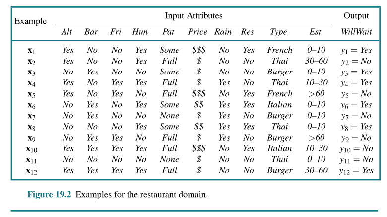
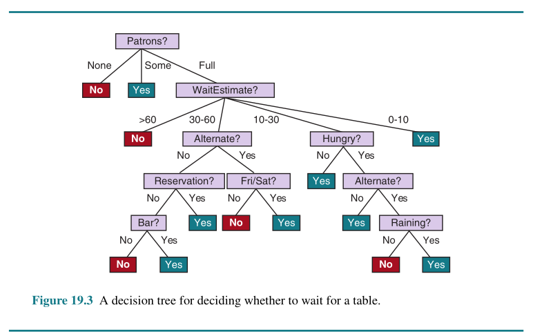
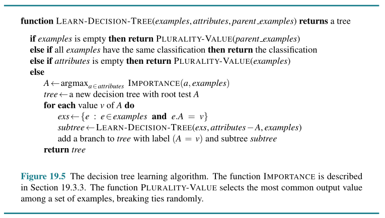
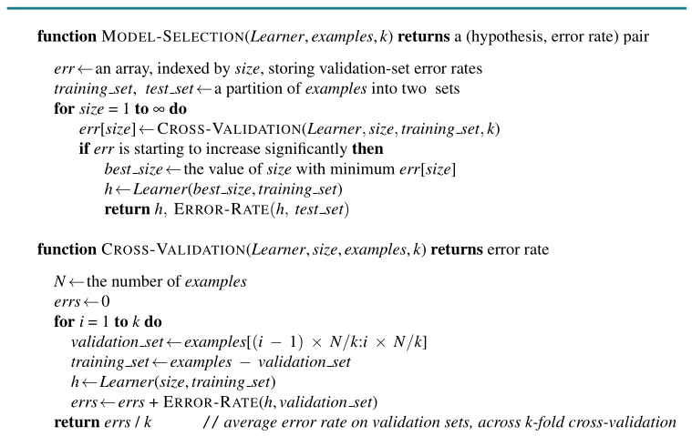
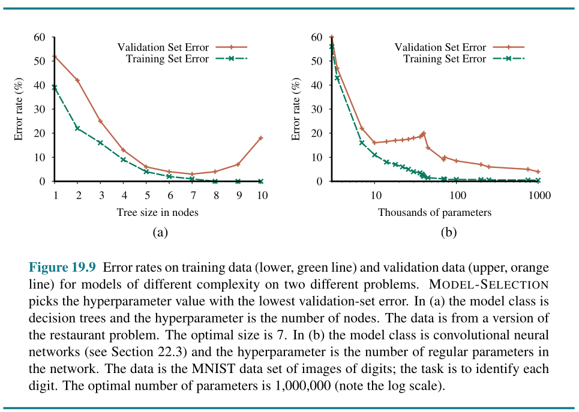
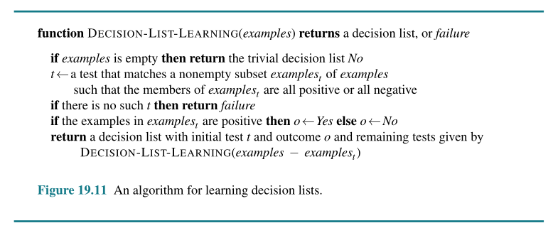
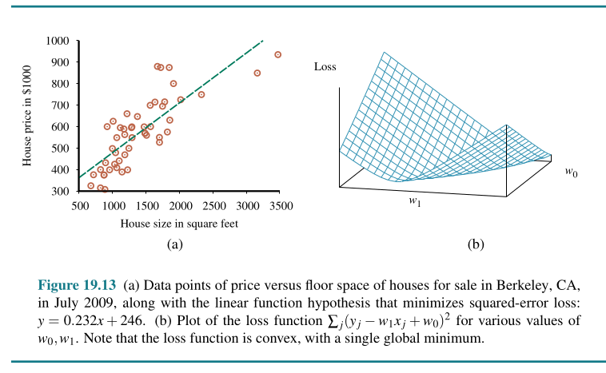
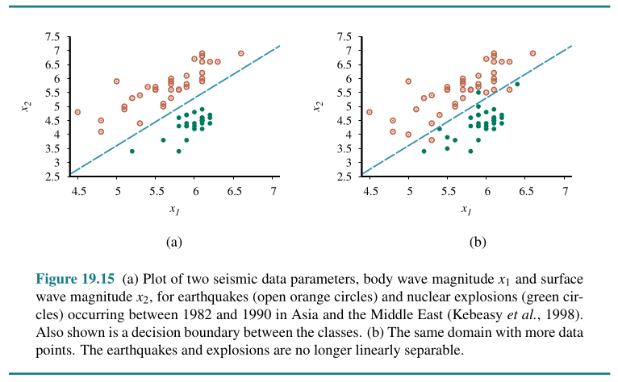
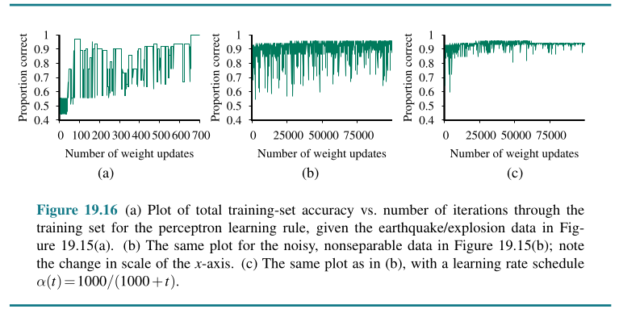

# Unidad 4 
## Machine Learning y Redes Neuronales

---

# Contenido

- Formas de Aprendizaje
- Aprendizaje Supervisado
- Aprendizaje de Árboles de Decisión
- Selección y Optimización de Modelos
- La Teoría del Aprendizaje
- Regresión Lineal y Clasificación
- Modelos No Paramétricos
- Aprendizaje por Ensamble
- Desarrollo de Sistemas de Aprendizaje Automático

---

# Formas de Aprendizaje

---
1. **Aprendizaje Supervisado**
   - El agente observa pares de entrada-salida
   - Aprende una función que mapea de entrada a salida

2. **Aprendizaje No Supervisado**
   - El agente aprende patrones en la entrada sin retroalimentación explícita
   - Ejemplo: agrupamiento (clustering)

3. **Aprendizaje por Refuerzo**
   - El agente aprende de una serie de refuerzos: recompensas y castigos

---

# Aprendizaje Supervisado

- Conjunto de entrenamiento de ejemplos: 
  - $(x_1, y_1), (x_2, y_2), \ldots, (x_N, y_N)$
- Objetivo: 
  - Aprender la función $y = f(x)$
- La hipótesis $h$ aproxima la función verdadera $f$
- Espacio de hipótesis $H$ de funciones posibles para aproximar los valores

---

Conceptos clave:
- Hipótesis consistente: $h(x_i) = y_i$ para todos los ejemplos de entrenamiento
- Generalización: Qué tan bien $h$ maneja entradas no vistas
- Conjunto de prueba: Usado para evaluar la generalización

---

# Ajuste de Hipótesis a los Datos

---

# Ajuste de Hipótesis a los Datos

- Fila superior: Funciones de mejor ajuste de cuatro espacios de hipótesis en el conjunto de datos 1
- Fila inferior: Las mismas funciones entrenadas en un conjunto de datos ligeramente diferente

---

# Sesgo y Varianza

- **Sesgo**: Tendencia de una hipótesis a desviarse del valor esperado
- **Subajuste**: Falla en encontrar un patrón en los datos
- **Varianza**: Cantidad de cambio en la hipótesis debido a fluctuaciones en los datos de entrenamiento
- **Sobreajuste**: Presta demasiada atención a datos de entrenamiento particulares
- **Compromiso sesgo-varianza**: Elección entre hipótesis complejas de bajo sesgo e hipótesis más simples de baja varianza

---

# Enfoque Probabilístico

En lugar de solo determinar si una hipótesis es posible, calculamos su probabilidad:

$h^* = \arg\max_{h \in H} P(h|\text{datos})$

Por la regla de Bayes:

$h^* = \arg\max_{h \in H} P(\text{datos}|h) P(h)$

---

## Ejemplo: Problema de Espera en Restaurante

Atributos de entrada:
  1. Alternativa
  2. Bar
  3. Vie/Sáb
  4. Hambriento
  5. Clientes
  6. Precio
  
---

## Ejemplo: Problema de Espera en Restaurante

  7. Lluvia
  8. Reserva
  9. Tipo
  10. EstimaciónEspera

Salida: 
  - Esperan (Booleano)

---

## Ejemplo: Problema de Espera en Restaurante

---

# Árboles de Decisión

- Representa una función que mapea valores de atributos a salidas
- Realiza una secuencia de pruebas desde la raíz hasta la hoja
- Nodos internos: pruebas sobre atributos
- Ramas: posibles valores de atributos
- Nodos hoja: valores de salida

Objetivo del algoritmo de aprendizaje: Encontrar un árbol pequeño consistente con los ejemplos de entrenamiento

---
## Arboles de decisión

---

## Arboles de decisión: Algoritmo

---

# División de Ejemplos

---

# Conclusiones

(a) Dividir por Tipo no es efectivo
(b) Dividir por Clientes separa bien los ejemplos positivos y negativos

---

# Curva de Aprendizaje para Árboles de Decisión

- Eje X: Número de ejemplos
- Eje Y: Precisión predictiva
- Muestra la mejora a medida que se usan más datos para el entrenamiento

---

## Ejemplo curva de aprendizaje

---

# Elección de Pruebas de Atributos

**Entropía**: Medida de incertidumbre de una variable aleatoria

$H(V) = -\sum_k P(v_k) \log_2 P(v_k)$

**Ganancia de Información**: Reducción esperada en la entropía

$\text{Ganancia}(A) = H(\text{objetivo}) - \sum_{v \in \text{valores}(A)} \frac{|\{x \in \text{ejemplos} : A(x)=v\}|}{|\text{ejemplos}|} ...$

$... H(\{x \in \text{ejemplos} : A(x)=v\})$

---

## Generalización y overfitting

Tecnicas de overfitting para árboles de decisiciones:
- Poda de arbol de decisiónes
  - Elimina decisipones irrelevantes
- Prueba de significancia
  - Prueba estadística por hipótesis de nulidad para ver que tanto se desvia la predicción sin ese atributo
- $\chi^2$ prunning
  - Tecnica matemática que usa el delta del error para calcular esta variable y aplicar un filtro en base a esta

---

## Ampliación de la Aplicabilidad de Árboles de Decisión

Manejo de complicaciones:
1. Datos faltantes
2. Atributos de entrada continuos y multivaluados
3. Atributos de salida de valor continuo

Nota: Los árboles de decisión pueden ser inestables - pequeños cambios en los datos pueden llevar a grandes cambios en el árbol

---

### Selección y Optimización de Modelos

Dos subtareas:
1. **Selección de modelo**: Elegir un buen espacio de hipótesis
2. **Optimización**: Encontrar la mejor hipótesis dentro de ese espacio

Conjuntos de datos necesarios:
1. Conjunto de entrenamiento
2. Conjunto de validación (conjunto de desarrollo)
3. Conjunto de prueba

---

Validación cruzada:
- Validación cruzada de k-pliegues
- Validación cruzada dejando uno fuera (LOOCV)

---

## Algoritmos modelo y cross-validation

---

##### Tasas de Error y Complejidad del Modelo

---

### Tasas de Error y Complejidad del Modelo

(a) Árboles de decisión: El tamaño óptimo es de 7 nodos
(b) Redes neuronales: Parámetros óptimos ≈ 1.000.000

---

### Regularización y Selección de Características

**Regularización**: Penalización de hipótesis complejas

Minimizar: $\text{Pérdida}(h) + \lambda \cdot \text{Complejidad}(h)$

**Selección de Características**: Reducir dimensiones descartando atributos irrelevantes

---

### Regularización y Selección de Características

**Métodos de Ajuste de Hiperparámetros**:
- Ajuste manual
- Búsqueda en cuadrícula
- Búsqueda aleatoria
- Optimización bayesiana
- Entrenamiento basado en población (PBT)

---

## La Teoría del Aprendizaje

Ejemplo: Listas de Decisión

$\text{Esperan} \Leftrightarrow (\text{Clientes} = \text{Algunos}) \lor (\text{Clientes} = \text{Lleno} \land \text{Vie/Sab})$

---

## Ejemplo: Listas de Decisión: Algoritmo

---

### Regresión Lineal

Regresión lineal univariada:
$y = w_1x + w_0$

Objetivo: Encontrar pesos $(w_0, w_1)$ que minimicen la pérdida empírica

Función de pérdida de error cuadrático:
$L_2 = \sum_j (y_j - (w_1x_j + w_0))^2$

Descenso de Gradiente:
$w_i \leftarrow w_i - \alpha \frac{\partial}{\partial w_i} \text{Pérdida}(w)$

---
### Not(HillClimbing) = GradientDescent

---

# Regresión Lineal Multivariable

$h_w(x) = w \cdot x = \sum_i w_i x_i$

Ecuación de actualización para cada peso:

$w_i \leftarrow w_i + \alpha \sum_j (y_j - h_w(x_j)) x_{ji}$

---

## Regresión Lineal Multivariable

---

# Clasificación Lineal

Límite de decisión: Línea (o superficie) que separa las clases

Separador lineal: $h_w(x) = \text{Umbral}(w \cdot x)$

Actualizaciones de peso durante el entrenamiento:
- Salida correcta: Sin cambios
- Falso negativo: Aumentar $w_i$ para $x_i$ positivos, disminuir para $x_i$ negativos
- Falso positivo: Disminuir $w_i$ para $x_i$ positivos, aumentar para $x_i$ negativos

---

---

# Regresión Logística para clasificacion lineal

Función logística: $g(z) = \frac{1}{1 + e^{-z}}$

Hipótesis: $h_w(x) = g(w \cdot x)$

---

---

# Modelos No Paramétricos

- Aprendizaje basado en instancias
- k-vecinos más cercanos
- Regresión localmente ponderada

---

# Máquinas de Vectores de Soporte (SVM)

Propiedades:
1. Separador de margen máximo
2. Hiperplano separador lineal
3. No paramétrico

Problema de optimización:
$\max_{\alpha} \sum_j \alpha_j - \frac{1}{2} \sum_j \sum_k \alpha_j \alpha_k y_j y_k (x_j \cdot x_k)$

sujeto a $\alpha_j \geq 0$ y $\sum_j \alpha_j y_j = 0$

---

# Aprendizaje por Ensamble

Combinar múltiples hipótesis para mejores predicciones

Métodos:
1. Bagging
2. Boosting
3. Stacking

---

# Boosting

- Conjunto de entrenamiento ponderado
- Ajuste iterativo de pesos de ejemplos mal clasificados
- Combinar múltiples aprendices débiles en un ensamble fuerte

---

## Desarrollo de Sistemas de Aprendizaje Automático

Aspectos clave:
1. Formulación del problema
2. Recolección y gestión de datos
3. Ingeniería de características
4. Selección y entrenamiento de modelos
5. Confianza, interpretabilidad y explicabilidad
6. Operación, monitoreo y mantenimiento

---

Consideraciones de prueba:
- Pruebas de infraestructura
- Pruebas de monitoreo
- Pruebas de características y datos
- Pruebas de desarrollo de modelos

---

# Resumen

- Aprendizaje supervisado: Se proporcionan respuestas correctas para ejemplos
- Regresión vs. Clasificación
- Árboles de decisión y ganancia de información
- Clasificadores lineales y regresión logística
- Modelos no paramétricos
- Máquinas de vectores de soporte
- Métodos de ensamble
- Importancia del desarrollo y prueba adecuados de sistemas en aprendizaje automático
