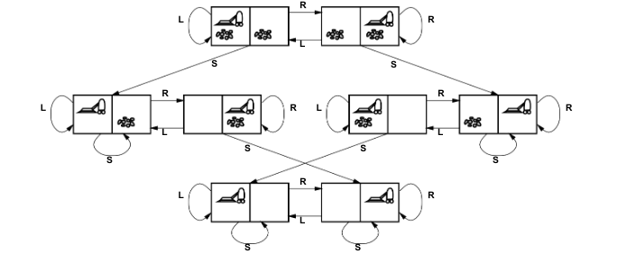

<style>
img[alt~="center"] {
  display: block;
  margin: 0 auto;
}
</style>

# Resolución de Problemas Mediante Búsqueda
## Capítulo 3

---

# Esquema

- Agentes de resolución de problemas
- Ejemplos de problemas
- Formulación de problemas
- Algoritmos de búsqueda
- Estrategias de búsqueda no informada
- Estrategias de búsqueda informada (heurística)
- Funciones heurísticas

---

# Agentes de resolución de problemas

Forma restringida de agente general:

```python
función Agente-Resolución-Problemas-Simple(percepción) devuelve una acción
  estático: sec, una secuencia de acciones, inicialmente vacía
           estado, alguna descripción del estado actual del mundo
           meta, una meta, inicialmente nula
           problema, una formulación del problema
  
  estado ← Actualizar-Estado(estado, percepción)
  si sec está vacía entonces
    meta ← Formular-Meta(estado)
    problema ← Formular-Problema(estado, meta)
    sec ← Búsqueda(problema)
  acción ← Recomendación(sec, estado)
  sec ← Resto(sec, estado)
  devolver acción
```

Nota: esto es resolución de problemas offline; la solución se ejecuta "a ojos cerrados". La resolución de problemas online implica actuar sin conocimiento completo.

---

# Ejemplo: Rumania


- De vacaciones en Rumania; actualmente en Arad. El vuelo sale mañana desde Bucarest
- Formular meta: estar en Bucarest
- Formular problema: 
  - estados: varias ciudades
  - acciones: conducir entre ciudades
- Encontrar solución: secuencia de ciudades, por ejemplo, Arad, Sibiu, Fagaras, Bucarest

---

# Mapa de rumania


---
## Mapa de rumania simplificado


---


# Tipos de problemas

1. Determinista, completamente observable ⇒ problema de estado único
   - El agente sabe exactamente en qué estado estará; la solución es una secuencia

2. No observable ⇒ problema conformante
   - El agente puede no tener idea de dónde está; la solución (si existe) es una secuencia

3. No determinista y/o parcialmente observable ⇒ problema de contingencia
   - Las percepciones proporcionan nueva información sobre el estado actual
   - La solución es un plan contingente o una política
   - A menudo se entrelazan búsqueda y ejecución

4. Espacio de estados desconocido ⇒ problema de exploración ("online")

---

# Ejemplo: mundo de la aspiradora


- Estado único, inicio en #5. Solución: [Derecha, Aspirar]
- Conformante, inicio en {1,2,3,4,5,6,7,8}
  - por ejemplo, Derecha va a {2,4,6,8}
  - Solución: [Derecha, Aspirar, Izquierda, Aspirar]
- Contingencia, inicio en #5
  - Ley de Murphy: Aspirar puede ensuciar una alfombra limpia
  - Sensado local: suciedad, ubicación solamente
  - Solución: [Derecha, si hay suciedad entonces Aspirar]

---

# Formulación de problemas de estado único

Un problema se define por cuatro ítems:

1. Estado inicial, por ejemplo, "en Arad"
2. Función sucesora S(x) = conjunto de pares acción-estado
   por ejemplo, S(Arad) = {(Arad → Zerind, Zerind), ...}
3. Prueba de meta, puede ser
   - explícita, por ejemplo, x = "en Bucarest"
   - implícita, por ejemplo, NoHaySuciedad(x)
4. Costo del camino (aditivo)
   - por ejemplo, suma de distancias, número de acciones ejecutadas, etc.
   - c(x, a, y) es el costo del paso, se asume ≥ 0

Una solución es una secuencia de acciones que lleva del estado inicial a un estado meta

---

# Selección de un espacio de estados

- El mundo real es absurdamente complejo ⇒ el espacio de estados debe ser abstraído para la resolución de problemas
- Estado (abstracto) = conjunto de estados reales
- Acción (abstracta) = combinación compleja de acciones reales
  - por ejemplo, "Arad → Zerind" representa un conjunto complejo de posibles rutas, desvíos, paradas de descanso, etc.
- Para garantizar la realizabilidad, cualquier estado real "en Arad" debe llegar a algún estado real "en Zerind"
- Solución (abstracta) = conjunto de caminos reales que son soluciones en el mundo real

¡Cada acción abstracta debería ser "más fácil" que el problema original!

---


# 




---


- Estados: ubicaciones enteras de suciedad y robot (ignorar cantidades de suciedad, etc.)
- Acciones: Izquierda, Derecha, Aspirar, NoOp
- Prueba de meta: sin suciedad
- Costo del camino: 1 por acción (0 para NoOp)

---

# Ejemplo: El 8-puzzle


- Estados: ubicaciones enteras de las fichas (ignorar posiciones intermedias)
- Acciones: mover el espacio en blanco a la izquierda, derecha, arriba, abajo (ignorar desatascar, etc.)
- Prueba de meta: = estado meta (dado)
- Costo del camino: 1 por movimiento

[Nota: la solución óptima de la familia n-Puzzle es NP-hard]

---

# Ejemplo: ensamblaje robótico


- Estados: coordenadas de valor real de los ángulos de las articulaciones del robot, partes del objeto a ensamblar
- Acciones: movimientos continuos de las articulaciones del robot
- Prueba de meta: ensamblaje completo sin incluir el robot
- Costo del camino: tiempo de ejecución

---

# Algoritmos de búsqueda en árbol

Idea básica:
- exploración offline y simulada del espacio de estados generando sucesores de estados ya explorados (también conocido como expansión de estados)

```python
función Búsqueda-Árbol(problema, estrategia) devuelve una solución, o falla
  inicializar el árbol de búsqueda usando el estado inicial del problema
  bucle hacer
    si no hay candidatos para expansión entonces devolver falla
    elegir un nodo hoja para expansión según la estrategia
    si el nodo contiene un estado meta entonces devolver la solución correspondiente
    si no expandir el nodo y agregar los nodos resultantes al árbol de búsqueda
```

---

# Ejemplo de búsqueda en árbol


---

# Implementación: estados vs. nodos

- Un estado es una (representación de) configuración física
- Un nodo es una estructura de datos que constituye parte de un árbol de búsqueda
  - incluye padre, hijos, profundidad, costo del camino g(x)
- ¡Los estados no tienen padres, hijos, profundidad ni costo del camino!

---

# Nodo vs estaos


La función Expandir crea nuevos nodos, completando los diversos campos y usando la FunciónSucesora del problema para crear los estados correspondientes.

---

# Implementación: búsqueda en árbol general

```python
función Búsqueda-Árbol(problema, frontera) devuelve una solución, o falla
  frontera ← Insertar(Crear-Nodo(Estado-Inicial[problema]), frontera)
  bucle hacer
    si frontera está vacía entonces devolver falla
    nodo ← Remover-Frente(frontera)
    si Prueba-Meta(problema, Estado(nodo)) entonces devolver nodo
    frontera ← InsertarTodos(Expandir(nodo, problema), frontera)

función Expandir(nodo, problema) devuelve un conjunto de nodos
  sucesores ← el conjunto vacío
  para cada acción, resultado en Función-Sucesora(problema, Estado[nodo]) hacer
    s ← un nuevo Nodo
    Nodo-Padre[s] ← nodo; Acción[s] ← acción; Estado[s] ← resultado
    Costo-Camino[s] ← Costo-Camino[nodo] + Costo-Paso(nodo, acción, s)
    Profundidad[s] ← Profundidad[nodo] + 1
    agregar s a sucesores
  devolver sucesores
```

---

# Estrategias de búsqueda

Una estrategia se define eligiendo el orden de expansión de nodos

Las estrategias se evalúan según las siguientes dimensiones:
- completitud—¿siempre encuentra una solución si existe una?
- complejidad temporal—número de nodos generados/expandidos
- complejidad espacial—número máximo de nodos en memoria
- optimalidad—¿siempre encuentra una solución de costo mínimo?

La complejidad temporal y espacial se miden en términos de:
- b—factor de ramificación máximo del árbol de búsqueda
- d—profundidad de la solución de costo mínimo
- m—profundidad máxima del espacio de estados (puede ser ∞)

---

# Estrategias de búsqueda no informada

Las estrategias no informadas usan solo la información disponible en la definición del problema

1. Búsqueda en anchura
2. Búsqueda de costo uniforme
3. Búsqueda en profundidad
4. Búsqueda en profundidad limitada
5. Búsqueda en profundidad iterativa

---

# Búsqueda en anchura

- Expandir el nodo no expandido menos profundo
- Implementación: la frontera es una cola FIFO, es decir, los nuevos sucesores van al final


---

# Propiedades de la búsqueda en anchura

- Completa: Sí (si b es finito)
- Tiempo: 1 + b + b^2 + b^3 + ... + b^d + b(b^d - 1) = O(b^(d+1)), es decir, exp. en d
- Espacio: O(b^(d+1)) (mantiene cada nodo en memoria)
- Óptima: Sí (si el costo = 1 por paso); no óptima en general

El espacio es el gran problema; puede generar fácilmente nodos a 100MB/seg, así que 24hrs = 8640GB.

---

# Tabla de busqueda a lo ancho comparativa


---

# Conclusiones

- Para la busqueda en ancho es un problema más grande los requisitos de memoria para la búsqueda a lo ancho que el tiempo de ejecución.
- En general, los problemas de búsqueda de complejidad exponencial no pueden resolverse por métodos sin información salvo casos pequeños.

---

# Búsqueda de costo uniforme

- Expandir el nodo no expandido de menor costo
- Implementación: frontera = cola ordenada por costo del camino, el más bajo primero
- Equivalente a búsqueda en anchura si todos los costos de paso son iguales


---

## Busqueda de costo uniforme: propiedades

- Completa: Sí, si el costo del paso ≥ ε
- Tiempo: # de nodos con g ≤ costo de la solución óptima, O(b^(C*/ε))
  donde C* es el costo de la solución óptima
- Espacio: # de nodos con g ≤ costo de la solución óptima, O(b^(C*/ε))
- Óptima: Sí—los nodos se expanden en orden creciente de g(n)


---

# Búsqueda en profundidad

- Expandir el nodo no expandido más profundo
- Implementación: frontera = cola LIFO, es decir, poner los sucesores al frente


---


---

## Búsqueda en profundidad: Propiedades

- Completa: No: falla en espacios de profundidad infinita, espacios con bucles
  - Modificar para evitar estados repetidos a lo largo del camino ⇒ completa en espacios finitos
- Tiempo: O(b^m): terrible si m es mucho mayor que d
  - pero si las soluciones son densas, puede ser mucho más rápida que la búsqueda en anchura
- Espacio: O(bm), es decir, ¡espacio lineal!
- Óptima: No

---

# Búsqueda en profundidad limitada

Es una búsqueda en profundidad con límite de profundidad 1, es decir, los nodos a profundidad 1 no tienen sucesores

```pseudocode
función Búsqueda-Profundidad-Limitada(problema, límite) devuelve solución/falla/corte
  DPL-Recursiva(Crear-Nodo(Estado-Inicial[problema]), problema, límite)

función BPL-Recursiva(nodo, problema, límite) devuelve solución/falla/corte
  ocurrió-corte? ← falso
  si Prueba-Meta(problema, Estado[nodo]) entonces devolver nodo
  sino si Profundidad[nodo] = límite entonces devolver corte
  sino para cada sucesor en Expandir(nodo, problema) hacer
    resultado ← DPL-Recursiva(sucesor, problema, límite)
    si resultado = corte entonces ocurrió-corte? ← verdadero
    sino si resultado ≠ falla entonces devolver resultado
  si ocurrió-corte? entonces devolver corte sino devolver falla
```

---

## Algoritmo BPL


---

# Búsqueda en profundidad iterativa

```python
función Búsqueda-Profundidad-Iterativa(problema) devuelve una solución
  entradas: problema, un problema

  para profundidad ← 0 hasta ∞ hacer
    resultado ← Búsqueda-Profundidad-Limitada(problema, profundidad)
    si resultado ≠ corte entonces devolver resultado
```

---


---

# Propiedades de la búsqueda en profundidad iterativa

- Completa: Sí
- Tiempo: (d+1)b^0 + db^1 + (d-1)b^2 + ... + b^d = O(b^d)
- Espacio: O(bd)
- Óptima: Sí, si el costo del paso = 1

Se puede modificar para explorar el árbol de costo uniforme

---

Comparación numérica para b = 10 y d = 5, solución en la hoja más a la derecha:
- N(BPI) = 50 + 400 + 3.000 + 20.000 + 100.000 = 123.450
- N(BA) = 10 + 100 + 1.000 + 10.000 + 100.000 + 999.990 = 1.111.100

BPI funciona mejor porque otros nodos a profundidad d no se expanden
BA se puede modificar para aplicar la prueba de meta cuando se genera un nodo

---

# Busqueda bidireccional

Los algoritmos anterioes parten de un estado inicial y llegan a otro buscando multiples estados meta posibles. 

Un enfoque alternativo es buscar bidireccionalmente, desde el estado inicial en adelante y al mismo tiempo, desde el estado objetivo hacia atras, esperando que ambas busquedas se encuentren.

---

# Busqueda bidireccional


---


---

## Resumen de algoritmos de búsqueda no informada


---

### Búsqueda en grafos: Algoritmo general

```python
función Búsqueda-Grafo(problema, frontera) devuelve una solución, o falla
  cerrado ← un conjunto vacío
  frontera ← Insertar(Crear-Nodo(Estado-Inicial[problema]), frontera)
  bucle hacer
    si frontera está vacía entonces devolver falla
    nodo ← Remover-Frente(frontera)
    si Prueba-Meta(problema, Estado[nodo]) entonces devolver nodo
    si Estado[nodo] no está en cerrado entonces
      agregar Estado[nodo] a cerrado
      frontera ← InsertarTodos(Expandir(nodo, problema), frontera)
```

El conjunto cerrado puede ser interpretado como una hash table para comprobar estados repetidos eficientemente.

---
# Estartegia de Busqueda informada (Heurística)

La busqueda de estrategia informada se basa en usar conocimiento especifico al dominio del problema sobre la ubicacion de las metas. 

Basicamente, pistas sobre el camino a la solucion. Estas pistas vienen en forma de **funciones heurísticas**.


*h(n)* = costo estimado del camino mas corto del estado en el nodo *n* al nodo objetivo.

---

### Búsqueda del mejor primero (best first search)

Idea: usar una función de evaluación para cada nodo
- Estimación de "deseabilidad"
⇒ Expandir el nodo no expandido más deseable

Implementación: **frontera** es una cola ordenada en orden decreciente de deseabilidad

Casos especiales:
1. búsqueda avara
2. búsqueda A*

---

### Búsqueda avara (Greedy BFS)

Función de evaluación h(n) (heurística) = estimación del costo desde n hasta la meta más cercana

Por ejemplo, hDLR(n) = distancia en línea recta desde n hasta Bucarest

La búsqueda avara expande el nodo que parece estar más cerca de la meta

---


---

# Propiedades de la búsqueda avara

- Completa: No–puede quedar atrapada en bucles, por ejemplo, Iasi → Neamt → Iasi → Neamt →
  - Completa en espacio finito con verificación de estados repetidos
- Tiempo: O(b^m), pero una buena heurística puede dar una mejora dramática
- Espacio: O(b^m)—mantiene todos los nodos en memoria
- Óptima: No

---

# Búsqueda A*

Idea: evitar expandir caminos que ya son costosos

Función de evaluación f(n) = g(n) + h(n)
- g(n) = costo hasta ahora para alcanzar n
- h(n) = costo estimado hasta la meta desde n
- f(n) = costo total estimado del camino a través de n hasta la meta

---

La búsqueda A* usa una heurística admisible
- es decir, h(n) ≤ h*(n) donde h*(n) es el costo real desde n.
- (También se requiere h(n) ≥ 0, así que h(G) = 0 para cualquier meta G.)

Por ejemplo, hDLR(n) nunca sobreestima la distancia real por carretera

Teorema: La búsqueda A* es óptima

---


---


---
# Optimalidad de A* (prueba estándar)

Supongamos que se ha generado alguna meta subóptima G2 y está en la cola. Sea n un nodo no expandido en un camino más corto hacia una meta óptima G1.

f(G2) = g(G2) ya que h(G2) = 0
      > g(G1) ya que G2 es subóptima
      ≥ f(n) ya que h es admisible

Como f(G2) > f(n), A* nunca seleccionará G2 para expansión

---

# Optimalidad de A* (más útil)

Lema: A* expande nodos en orden de f creciente

Gradualmente agrega "contornos-f" de nodos (cf. búsqueda en anchura agrega capas)
El contorno i tiene todos los nodos con f = fi, donde fi < fi+1

---


---

# Propiedades de A*

- Completa: Sí, a menos que haya infinitos nodos con f ≤ f(G)
- Tiempo: Exponencial en [error relativo en h × longitud de la solución]
- Espacio: Mantiene todos los nodos en memoria
- Óptima: Sí—no puede expandir fi+1 hasta que fi esté terminado
  - A* expande todos los nodos con f(n) < C*
  - A* expande algunos nodos con f(n) = C*
  - A* no expande nodos con f(n) > C*

---

# Prueba del lema: Consistencia

Una heurística es consistente si h(n) ≤ c(n, a, n') + h(n')

Si h es consistente, tenemos:
f(n') = g(n') + h(n')
      = g(n) + c(n, a, n') + h(n')
      ≥ g(n) + h(n)
      = f(n)

Es decir, f(n) no decrece a lo largo de cualquier camino.

---

# Heurísticas admisibles

Por ejemplo, para el 8-puzzle:
- h1(n) = número de fichas mal ubicadas
- h2(n) = distancia de Manhattan total (es decir, número de cuadrados desde la ubicación deseada de cada ficha)

h1(S) = 6
h2(S) = 4+0+3+3+1+0+2+1 = 14

---


---

# Dominancia

Si h2(n) ≥ h1(n) para todo n (ambas admisibles), entonces h2 domina a h1 y es mejor para la búsqueda

Costos de búsqueda típicos:
- d = 14
  - BPI = 3.473.941 nodos
  - A*(h1) = 539 nodos
  - A*(h2) = 113 nodos

---

- d = 24
  - BPI ≈ 54.000.000.000 nodos
  - A*(h1) = 39.135 nodos
  - A*(h2) = 1.641 nodos

Dadas cualesquiera heurísticas admisibles *ha*, *hb*, *h(n)* = max(*ha(n)*, *hb(n)*) también es admisible y domina a *ha*, *hb*.

---

# Problemas relajados

Las heurísticas admisibles se pueden derivar del costo de solución exacto de una versión relajada del problema

- Si las reglas del 8-puzzle se relajan para que una ficha pueda moverse a cualquier lugar, entonces h1(n) da la solución más corta
- Si las reglas se relajan para que una ficha pueda moverse a cualquier cuadrado adyacente, entonces h2(n) da la solución más corta

Punto clave: el costo de solución óptimo de un problema relajado no es mayor que el costo de solución óptimo del problema real

---

# Problemas relajados (cont.)

Ejemplo bien conocido: problema del viajante de comercio (TSP)
- Encontrar el recorrido más corto que visite todas las ciudades exactamente una vez

El árbol de expansión mínima se puede calcular en O(n^2) y es una cota inferior del recorrido (abierto) más corto

---


---

# Resumen

- Un problema consiste en cinco partes: el estado inicial, un conjunto de acciones, un modelo de transición que describe los resultados de esas acciones, un conjunto de estados meta y una función de costo de acción.

- Los métodos de búsqueda no informada tienen acceso solo a la definición del problema. Los algoritmos construyen un árbol de búsqueda en un intento de encontrar una solución.

- Los métodos de búsqueda informada tienen acceso a una función heurística h(n) que estima el costo de una solución desde n.

